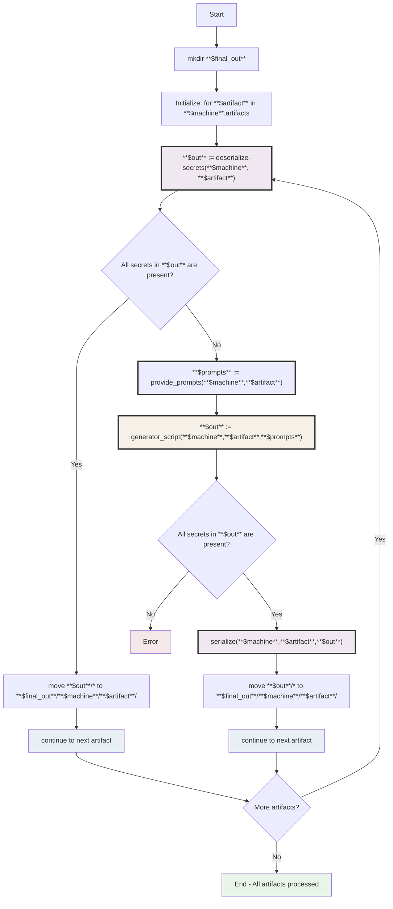

# NixOS Artifacts Store

## Overview

Nixos-artifacts is a framework to unify artifacts and secrets in NixOS flakes.

Inspired by:

- [Clan vars](https://docs.clan.lol/guides/vars-backend/)
- [NixOS PR #370444](https://github.com/NixOS/nixpkgs/pull/370444)

> **Note:** This project is currently in the design phase.

## Core Concept

NixOS-artifacts provides an abstraction layer over various secret management
backends, including:

- [agenix](https://github.com/ryantm/agenix)
- [sops-nix](https://github.com/Mic92/sops-nix) (not yet)
- [colmena](https://github.com/zhaofengli/colmena) (not yet)

### Key Features

- **Standardized Interface**: Common API for defining and managing secrets
- **Secret Rotation**: Built-in workflow for secret generation and rotation
- **Multi-Backend Support**: Mix different backends within the same
  configuration. You can choose different backends for each artifact.

### Limitations

To maintain compatibility across backends, some specialized features of
individual backends may not be accessible directly (e.g., public vars in
[clan](https://docs.clan.lol/concepts/generators/)).

### Implementation

Each backend is provided as a separate flake that you can add to your
configuration as needed.

## Artifact Workflow

The diagram below illustrates the process of artifact generation, validation,
and serialization.

### Legend

- Green: Success completion state
- Red: Error state
- Blue: Flow control operations
- Purple: Core artifact operations (deserialize, serialize) (defined by the
  backend)
- Yellow: User defined

## Configuration Reference

The artifacts system is organized into three main parts:

- **store** = "What are artifacts and where do they go?"
- **backend** = "How do we save and load artifacts?"
- **config** = "How do we customize the saving/loading behavior?"

### 1. `artifacts.store`

**Purpose:** Defines artifact specifications and target system locations

**Capabilities:**

- Provides the foundational abstractions for defining artifacts
- Contains generators for artifact creation
- Specifies the destination paths on target systems

#### prompt

> multiple times per artifact

`prompt.<name>` ends up as `$prompt/<name>` in the generator script.

#### file

> multiple times per artifact

`file.<name>.path` will be the handle of the file on the target system.

#### `serialize` Option

**Cardinality:** Once per artifact

**Default:** `artifacts.config.serialize.default`

**Purpose:** Defines how the artifact is serialized for storage

#### `deserialize` Option

**Cardinality:** Once per artifact

**Default:** `artifacts.config.deserialize.default`

**Purpose:** Defines how the artifact is deserialized from storage

#### `shared` Option

**Cardinality:** Once per artifact

**Effect:** Determines the output directory structure:

- When disabled: `machines/<machine>/` from `nixosConfigurations.<machine>`
- When enabled: `shared/`

### 2. `artifacts.backend`

**Purpose:** Implements the technical infrastructure for artifact storage

**Responsibilities:**

- Provides serialization/deserialization implementations
- Defines backend-specific operational logic
- Manages the physical storage of artifacts

**Directory Structure:**

- Machine-specific artifacts: `per-machine/<machine>/<artifact>/<filename>`
- Shared artifacts: `shared/<artifact>/<filename>`

### 3. `artifacts.config`

**Purpose:** Configures backend behavior and settings

**Responsibilities:**

- Provides customization options for backends
- Defines default serialization/deserialization methods
- Sets global behavior patterns

**Documentation:** Backend authors should provide comprehensive documentation
for their config options
