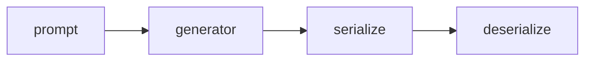

# Artifacts Store

Inspired by [clan vars](https://docs.clan.lol/guides/vars-backend/) and
[this pull-request](https://github.com/NixOS/nixpkgs/pull/370444)

### prompt

> multiple times per artifact

`prompt.<name>` ends up as `$prompt/<name>` in the generator script.

### file

> multiple times per artifact

`file.<name>.path` will be the handle of the file on the target system.

### serialize

> once per artifact

Defaults to `artifacts.config.serialize.default`, but can be overwritten.

### deserialize

> once per artifact

Defaults to `artifacts.config.deserialize.default`, but can be overwritten.

### shared

> once per artifact

handles what the `$out` variable will be usually it will be
`machines/<machine>/` from `nixosConfigurations.<machine>`, but with this
enabled it will be `shared/`

## Queue

- Check if you can deserialize all artifacts `=> $out/<artifact>/<files>`
  - if all artifacts exist the end up in `$out/<artifact>/<files>`
  - if not all artifacts are possible to deserialize, run the generator
    - generate `$out/<artifact>/<files>`
    - serialize generated secrets
      `$out/<artifacts>/<files> => $serialized/<artifacts>/<files>`
- copy
  `$out/<artifacts>/<files> => target-system/<artifact-store>/<artifact>/<files>`

> You can **skip** serialization/deserialization, which ends up generating a new
> artifact every time

## Options and conventions

### `artifacts.store`

This is where you define what artifacts are and how they work:

- Contains the basic building blocks (abstractions) that users need to define
- Includes generators that create artifacts
- Specifies where artifacts should appear on the target system

### `artifacts.backend`

This handles the technical details of saving and loading artifacts:

- Contains the code that converts artifacts to/from storage formats
  (serialization/deserialization)
- Has built-in opinions about how things should work
- Follows a specific folder structure:
  - `per-machine/<machine>/<artifact>/<filename>` - for machine-specific
    artifacts
  - `shared/<artifact>/<filename>` - for artifacts shared across machines

### `artifacts.config`

This is for customizing how backends behave:

- Used to set up and configure the backends
- Should be documented and provided by whoever creates the backend

---

**Think of it like this:**

- **store** = "What are artifacts and where do they go?"
- **backend** = "How do we save and load artifacts?"
- **config** = "How do we customize the saving/loading behavior?"
