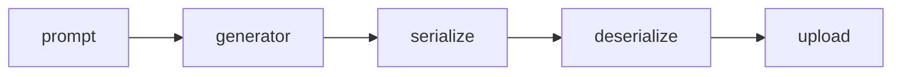

# Artifacts Store

# prompt 

`prompt.<name>` ends up as `$prompt/<name>` in the generator script.

# file

`file.<name>.path` will be the handle of the file on the target system.

# serialize

Defaults to `artifacts.serialize.default`, but can be overwritten.

#  deserialize

Defaults to `artifacts.deserialize.default`, but can be overwritten.

# upload

Defaults to `artifacts.upload.default`, but can be overwritten.
